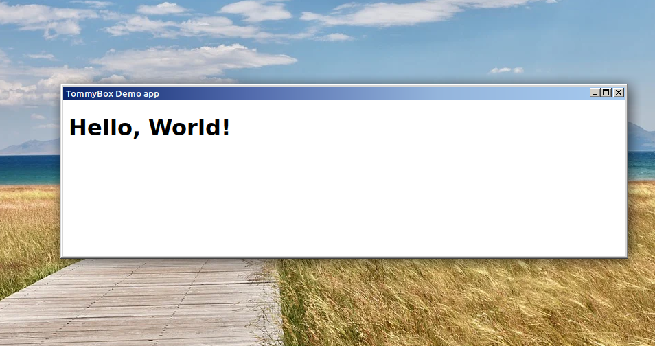

# 🍥 TommyBox
[](https://github.com/xnbox/tommybox/blob/master/LICENSE)
[](https://github.com/xnbox/tommybox/releases)
[](https://github.com/xnbox/tommy)




<h2>About:</h2>
<p><strong>TommyBox</strong> is a standalone executable container that makes it possible to launch static and dynamic web apps on a desktop by providing built-in server and browser functionality.
<br>
TommyBox is similar to Electron and NW.js.</p>

<p>
An app can be provided as a directory or packed as <abbr title="Web application ARchive">WAR</abbr> (or ZIP) archive that can contain <abbr title="Java Server Pages">JSP</abbr>, servlets, and static stuff like CSS, JavaScript, etc.
</p>

<p>
Under the hood, TommyBox is built on top of <a href="https://github.com/xnbox/tommy">Tommy</a> web server and SWT browser widget.
App can be packed as <abbr title="Web application ARchive">WAR</abbr> or ZIP archive and can optionally contain <abbr title="Progressive Web Apps">PWA</abbr> manifest</li>, <abbr title="Java Server Pages">JSP</abbr>, servlets and all static stuff like CSS, JavaScript files etc.
</p>

<p>
See TommyBox in action: <a href="https://github.com/xnbox/tommybox_demo">https://github.com/xnbox/tommybox_demo</a>
</p>

<h2>Download:</h2>
Latest release: <a href="https://github.com/xnbox/tommybox/releases/download/v2.14.1/tb-2.14.1.jar">tb-2.14.1.jar</a>


<h2>Features:</h2>
<ul>
    <li>Single cross-platform executable jar (starts from ~25Mb)</li>
    <li>No dependencies</li>
    <li>No installation</li>
    <li>No own configuration files, instead, TommyBox uses standard standard <abbr title="Progressive Web Apps">PWA</abbr> webmanifest and standard Tomcat configuration files</li>
    <li>
        Operating systems:
        <ul>
            <li>Linux</li>
            <li>macOS</li>
            <li>Windows</li>
        </ul>
    </li>
    <li>
        Architectures:
        <ul>
            <li>x86_64</li>
            <li>win32-x86_64</li>
            <li>aarch64</li>
            <li>ppc64le</li>
        </ul>
    </li>
	<li>Supports custom command line args, stdin, stdout, stderr</li>
    <li>
        Configurable display modes:
        <ul>
            <li>in-window</li>
            <li>in-browser</li>
            <li>fullscreen</li>
            <li>headless</li>
        </ul>
    </li>
    <li>Single and multiple windows modes</li>
    <li>Optional custom splash screen</li>
    <li>Optional custom context menu</li>
    <li>Optional custom system tray icon with custom menu</li>
</ul>

<h2>Supported web apps:</h2>
<ul>
	<li>WAR files</li>
	<li>Web apps packed as ZIP archives (including standard password-protected ZIPs)</li>
	<li>Exploded web apps (local directories)</li>
	<li>Remote WAR / ZIP files (on HTTP servers)</li>
	<li>Embedded WAR / ZIP files and directories</li>
</ul>

<h2>Command line:</h2>


```text
java -jar tb.jar [options] [custom arg1] [custom arg2] ...

Options:
  --help                   print help message
  --app <file | dir | URL> run app from ZIP (or WAR) archive, directory or URL
  --password <password>    provide password (for encrypted ZIP (or WAR) archive)

```


<h2>Run app:</h2>


Run ZIP (or WAR) file:
```bash
java -jar tb.jar --app MyKillerApp.war
```


Run ZIP (or WAR) file with custom command-line args:
```bash
java -jar tb.jar --app MyKillerApp.war myparam1 myparam2 ...
```


Run ZIP (or WAR) from web server:
```bash
java -jar tb.jar --app https://example.com/MyKillerApp.zip
```


Run exploded web app from directory:
```bash
java -jar tb.jar --app MyKillerAppDir
```


Run password-protected ZIP (or WAR) archive:
```bash
java -jar tb.jar --app MyKillerApp.zip --password mysecret
```


<h2>Embed app:</h2>
<ul>
    <li>Option 1. Copy your app content into the <code>/app</code> directory of the <code>tb.jar</code>.
    </li>
    <li>Option 2. Pack your app as <code>app.war</code> or <code>app.zip</code> (the archive can be encrypted) and copy the archive to the root directory of the <code>tb.jar</code>.
    </li>
</ul>

Brand your app by renaming the <code>tb.jar</code> to the <code>MyKillerApp.jar</code>.


Run embedded app:
```bash
java -jar MyKillerApp.jar
```


Run embedded app with custom command-line args:
```bash
java -jar MyKillerApp.jar myparam1 myparam2 ...
```


Run password-protected embedded app:
```bash
java -jar MyKillerApp.jar --password mysecret
```


Run password-protected embedded app with custom command-line args:
```bash
java -jar MyKillerApp.jar --password mysecret myparam1 myparam2 ...
```


<h2>TommyBox specific PWA manifest keys:</h2>
<br>
<table>
<thead>
	<tr><th>Key</th>                              <th>Type</th>                <th>Default value</th>                                 <th>Description</th></tr>
</thead>
<tbody>
	<tr><td><code>display</code></td>             <td><code>string</code></td> <td><code>standalone</code></td>                       <td>Standard PWA <code>display</code> mode.<br>Possible values:<br><code>standalone</code><br><code>minimal_ui</code><br><code>browser</code><br><code>fullscreen</code><br><code>minimized_window</code> (non-standard)<br><code>maximized_window</code> (non-standard)<br><code>desktop_area</code> (non-standard)<br><code>headless</code> (non-standard)</td></tr>
	<tr></tr>
	<tr><td><code>enable_fullscreen</code></td>   <td><code>boolean</code></td><td><code>true</code></td>                             <td>Allow fullscreen mode</td></tr>
	<tr></tr>
	<tr><td><code>tray_icon</code></td>           <td><code>boolean</code></td><td><code>true</code></td>                             <td>Tray icon</td></tr>
	<tr></tr>
	<tr><td><code>window_buttons</code></td>      <td><code>array</code></td>  <td><code>["minimize", "maximize", "close"]</code></td><td>Window buttons list.<br>Possible elements:<br><code>minimize</code><br><code>maximize</code><br><code>close</code></td></tr>
	<tr></tr>
	<tr><td><code>window_menu</code></td>         <td><code>string</code></td> <td><code>none</code></td>                             <td>Window menu mode.<br>Possible values:<br><code>custom</code><br><code>native</code><br><code>none</code></td></tr>
	<tr></tr>
	<tr><td><code>window_always_on_top</code></td><td><code>boolean</code></td><td><code>false</code></td>                            <td>Always on top window property</td></tr>
	<tr></tr>
	<tr><td><code>window_size</code></td>         <td><code>string</code></td> <td><code>null</code></td>                             <td>Window size as string Eg.: 640x480</td></tr>
	<tr></tr>
	<tr><td><code>window_x</code></td>            <td><code>number</code></td> <td><code>null</code></td>                             <td>Window location X coordinate (in pixels)</td></tr>
	<tr></tr>
	<tr><td><code>window_y</code></td>            <td><code>number</code></td> <td><code>null</code></td>                             <td>Window location Y coordinate (in pixels)</td></tr>
	<tr></tr>
	<tr><td><code>strings</code></td>             <td><code>array</code></td>  <td><code>[]</code></td>                               <td>I18N dictionary for custom strings</td></tr>
</tbody>
</table>
<br>

<h2>TommyBox specific URL protocols:</h2>

<table>
<thead>
	<tr><th>Protocol                     </th><th>Description                            </th><th>Example</th></tr>
</thead>
<tbody>
	<tr><td><code>quit:           </code></td><td>Exit to OS                             </td><td><code>&lt; href="quit:">Exit</a></code></td>
	<tr></tr>
	<tr><td><code>minimize:       </code></td><td>Minimize window                        </td><td><code>&lt; href="minimize:">Minimize</a></code></td>
	<tr></tr>
	<tr><td><code>fullscreen:     </code></td><td>Switch to fullscreen                   </td><td><code>&lt; href="fullscreen:">Fullscreen</a></code></td>
	<tr></tr>
	<tr><td><code>open:           </code></td><td>Open the given URL in default OS opener</td><td><code>&lt; href="open:">Open</a></code></td>
	<tr></tr>
	<tr><td><code>open_in_browser:</code></td><td>Open the given URL in browser          </td><td><code>&lt; href="open_in_browser:">Open in Browser</a></code></td>
	<tr></tr>
	<tr><td><code>java:           </code></td><td>Run Java code                          </td><td><code>&lt; href="java:">Exit</a>Launch Java Code</code></td>
	<tr></tr>
	<tr><td><code>js:             </code></td><td>Run JavaScript code                    </td><td><code>&lt; href="js:">Exit</a>Launch JavaScript Code</code></td>
</tbody>
</table>

<h2>Access to the custom command-line args and system streams programmatically (JNDI):</h2>


```java

// ...somewhere in your Servlet or JSP

InitialContext ctx = new InitialContext();

/* get custom command-line args */
String[] args = (String[]) ctx.lookup("java:comp/env/tommy/args");

/* get standard input (stdin) */
InputStream stdin = (InputStream) ctx.lookup("java:comp/env/tommy/stdin");

/* get standard output (stdout) */
PrintStream stdout = (PrintStream) ctx.lookup("java:comp/env/tommy/stdout");

/* get standard error (stderr) */
PrintStream stderr = (PrintStream) ctx.lookup("java:comp/env/tommy/stderr");

/* get "--app" parameter value */
String app = (String) ctx.lookup("java:comp/env/tommy/app");

// ...


```


<h2>F.A.Q.</h2>

<strong>Q.</strong> My app failed with <code>java.lang.ClassNotFoundException: javax.servlet.\*</code>
<br><br>
<strong>A.</strong> As a result of the move from Java EE to Jakarta EE, starting from v10, Apache Tomcat supports only the Jakarta EE spec. <code>javax.servlet.\*</code> is no longer supported.
Replace the <code>javax.servlet.\*</code> imports in your code with <code>jakarta.servlet.\*</code>.

